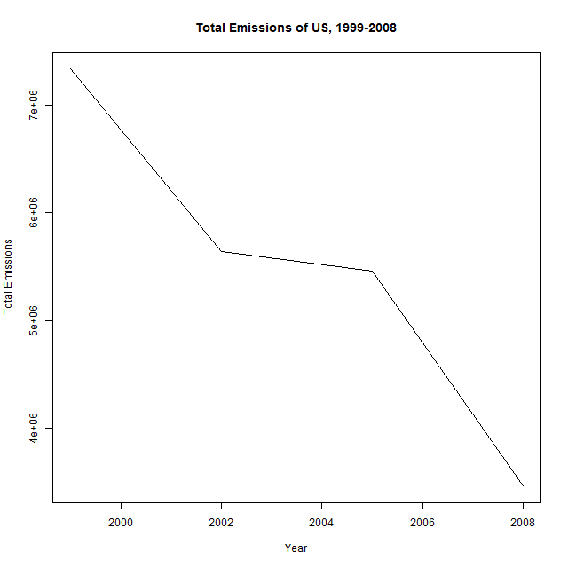
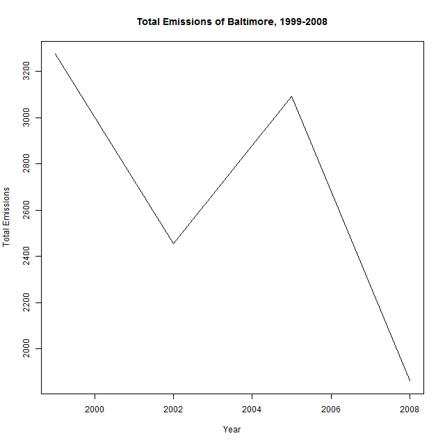
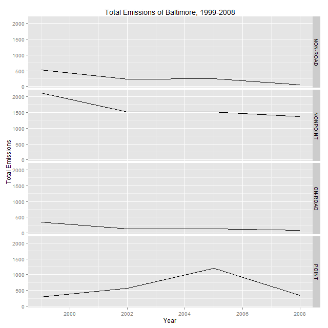
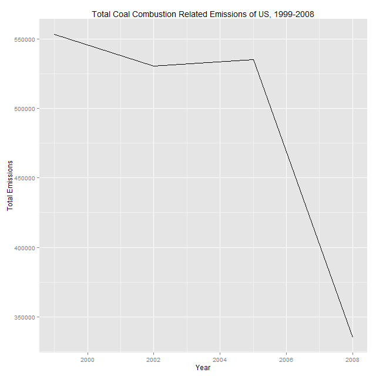
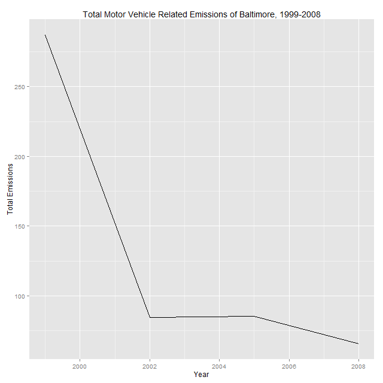
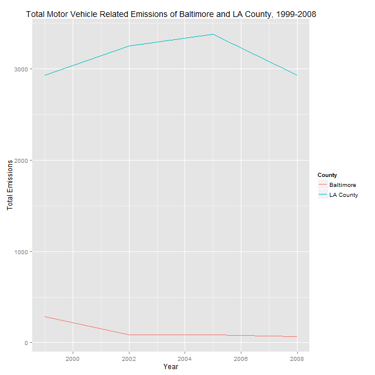

# Overview

## R Session

In this analysis two packages, namely, *data.table* and *ggplot2* are used for data mungling and data visualization, respectively.

## Results

The six required plots are inside the directory *figure*.

Below are my answers.

### Q1. Total Emissions in the United States from 1999 to 2008

 

We can see from the above figure that total emissions in the United States have decreased from 1999 to 2008.

### Q2. Total Emissions in the Baltimore City from 1999 to 2008


 
Generally speaking, the total emissions in the Baltimore City have decreased from 1999 to 2008. However, there is a noticeable fluctuation between 2002 and 2005.

### Q3. Total Emissions in the Baltimore City from 1999 to 2008 for Different Sources 



From the graph we know that the total emissions for **NON-POINT**, **ON-ROAD** and **NON-POINT** have decreased from 1999 to 2008.
The total emissions for **POINT** has increased from 1999 to 2005 and has decreased from 2005 to 2008. 

### Q4. Total Emissions in the United States from 1999 to 2008 for Coal Combustion Related Sources

I identified *Coal Combustion Related Sources* as follows. 
First I identified coal related SSCs in **SCC$SCC.Level.Three** using grep with key word **Coal**.

```r
coal_related_SCCs <- levels( SCC$SCC.Level.Three )[ grep( "Coal" , levels( SCC$SCC.Level.Three ) ) ]
```

Then I identified combustion related SSCs in **SCC$SCC.Level.One** using grep with key word **Combustion**.

```r
coal_related_SCCs <- levels( SCC$SCC.Level.Three )[ grep( "Coal" , levels( SCC$SCC.Level.Three ) ) ]
```

Based on the two sets of possible factor levels, I finally generated indices for *Coal Combustion Related SCCs* using element-wise AND operation:

```r
indices <- ( SCC$SCC.Level.Three %in% coal_related_SCCs ) & ( SCC$SCC.Level.One %in% combustion_related_SCCs )
coal_combustion_related_SCCs <- SCC$SCC[ indices ]
```

Below is the generated graph:

 

Generally speaking, the total coal combustion related emissions in the United States have decreased from 1999 to 2008 and there is a sharp decrease from 2005 to 2008.

### Q5. Total Emissions in the Baltimore City from 1999 to 2008 for Motor Vehicle Related Sources

I identified *Motor Vehicle Related Sources* as follows. 
First I identified motor vehicle related SSCs in **SCC$SCC.Level.Two** using grep with key word **Motor|Vehicle**.

```r
vehicle_related_SCCs_level_two <- levels( SCC$SCC.Level.Two )[ grep( "Motor|Vehicle" , levels( SCC$SCC.Level.Two ) ) ]
```

Then I identified motor vehicle related SSCs in **SCC$SCC.Level.Three** using grep with key word **Motor|Vehicle**.

```r
vehicle_related_SCCs_level_three <- levels( SCC$SCC.Level.Three )[ grep( "Motor|Vehicle" , levels( SCC$SCC.Level.Three ) ) ]
```

Based on the two sets of possible factor levels, I finally generated indices for *Motor Vehicle Related SCCs* using element-wise AND operation:

```r
indices <- ( SCC$SCC.Level.Two %in% vehicle_related_SCCs_level_two ) & ( SCC$SCC.Level.Three %in% vehicle_related_SCCs_level_three )
vehicle_related_SCCs <- SCC$SCC[ indices ]
```

Below is the generated graph:

 

Generally speaking, the total motor vehicle related emissions in the Baltimore City have decreased from 1999 to 2008. There is a sharp decrease from 1999 to 2002 then total emissions decreased gradually after that.

### Q6. Total Emissions from 1999 to 2008 for Motor Vehicle Related Sources in the Baltimore City and LA County

*Motor Vehicle Related Sources* are identified the same as in Q5. Below is the comparison.



From 1999 to 2008 the Baltimore City has seen greater change than LA County. The total emissions have decreased from *287.1* to *65.6* within 10 years while that in LA county have virtually stayed the same( *2929.0* in 1999 and  *2932.9* in 2008 )