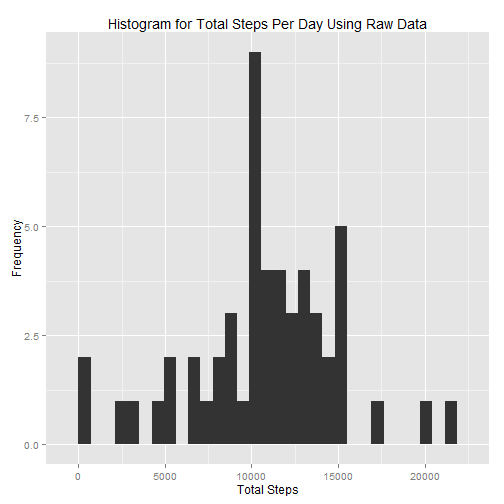

# Assignment 1 of Reproducible Research
### Alex Ge, alexgecontrol@qq.com

## Data Overview

The data for this assignment can be downloaded from the course web
site:

* Dataset: [Activity monitoring data](https://d396qusza40orc.cloudfront.net/repdata%2Fdata%2Factivity.zip) [52K]

The variables included in this dataset are:

* **steps**: Number of steps taking in a 5-minute interval (missing
    values are coded as `NA`)

* **date**: The date on which the measurement was taken in YYYY-MM-DD
    format

* **interval**: Identifier for the 5-minute interval in which
    measurement was taken

The dataset is stored in a comma-separated-value (CSV) file and there
are a total of 17,568 observations in this
dataset.

## Analysis Overview

In this assignment, three main problems--effects of imputing on mean and medians of total number of steps taken per day, average daily activity pattern and activity patterns between weekdays and weekends--are analyzed and reported.

## 0. Set Up R Session

In this assignment I use package *data.table* for data mungling and *ggplot2* for data visualization.
Below is my code for session setup.

```r
# Set working directory:
setwd( "C:/Users/thinkpad/Desktop/00-Mathematics/03-Statistics/01-Basic Statistics/Projects/01-Data-Specialization-JHU-Coursera/04-Reproducible-Research/01-Assignment-One" )
# Package for graphing:
library( ggplot2 )
# Package for data mungling:
library( data.table )
```

```
## data.table 1.9.4  For help type: ?data.table
## *** NB: by=.EACHI is now explicit. See README to restore previous behaviour.
```

## 1. Data Mungling

I created three new datasets from the raw data, namely,
the merged dataset of total number of steps taken per day made from raw and imputed data,
the average steps per interval data and
the average steps per interval data faceted by weekdays and weekends.
Below are the detailed mungling processes for each dataset.

### 1.1. Merged Dataset of Total Number of Steps Taken Per Day Made From Raw and Imputed Data

The mungling process for this dataset is as follows:


```r
# Raw data:
raw_data <- read.csv( "activity.csv" , header = TRUE , stringsAsFactors = FALSE )
raw_data_table <- data.table( raw_data )
# Imputed data:
imputed_data <- raw_data
imputed_data$steps[ is.na( imputed_data$steps ) ] <- median( imputed_data$steps , na.rm = TRUE )
imputed_data_table <- data.table( imputed_data )
# Total steps by day:
total_steps_by_day_raw <- raw_data_table[ , sum( steps ), by = date ]
total_steps_by_day_raw$Imputed <- "False"
total_steps_by_day_imputed <- imputed_data_table[ , sum( steps ), by = date ]
total_steps_by_day_imputed$Imputed <- "True"
total_steps_by_day <- rbind( total_steps_by_day_imputed , total_steps_by_day_raw )
setnames( total_steps_by_day , "V1" , "total.steps" )
total_steps_by_day$Imputed = factor( total_steps_by_day$Imputed , levels = c( "True" , "False" ) )
```

Here the factor attribute *Imputed* is added to facilitate further graphing.

### 1.2. Average Steps Per Interval Data

The mungling process for this dataset is as follows:


```r
# Average steps by interval:
mean_steps_by_interval <- imputed_data_table[ , mean( steps ), by = interval ]
setnames( mean_steps_by_interval , "V1" , "average.steps" )
```

### 1.3. Average Steps Per Interval Data Faceted by Weekdays and Weekends

The mungling process for this dataset is as follows:


```r
# Average steps by interval faceted by day type:
date <- strptime( imputed_data$date , "%Y-%m-%d" )
days <- weekdays( date , abbreviate = TRUE )
is_weekend <- days %in% c( "周六" , "周日" )
mean_steps_by_weekdays <- imputed_data_table[ !is_weekend , mean( steps ), by = interval ]
mean_steps_by_weekdays$Day <- "Weekdays"
mean_steps_by_weekend <- imputed_data_table[ is_weekend , mean( steps ), by = interval ]
mean_steps_by_weekend$Day <- "Weekend"
mean_steps_by_day <- rbind( mean_steps_by_weekdays , mean_steps_by_weekend )
setnames( mean_steps_by_day , "V1" , "average.steps" )
mean_steps_by_day$Day = factor( mean_steps_by_day$Day , levels = c( "Weekdays" , "Weekend" ) )
```

## 2. Mean and Median of Total Steps Per Day Using Raw Data

### 2.1. Histogram

Here is the histogram of total steps per day generated using raw data:



The code for plot generation is as follows:


```r
# Histogram:
qplot( total.steps , data = total_steps_by_day[ "False" == total_steps_by_day$Imputed , ] ,
       geom = "histogram" , 
       xlab = "Total Steps" , ylab = "Frequency" , main = "Histogram for Total Steps Per Day Using Raw Data" )
```

### 2.2. Mean and Median

The two statistics are summarized in the following table.

Statistics  |Mean                               |Median
:----------:|:---------------------------------:|:----------------------------------:
Value       |1.0766189 &times; 10<sup>4</sup>|10765

## 3. Average Steps Per Interval

### 3.1. Time Series Visualization

Here is the visualization of the data:


The code for plot generation is as follows:


```r
# Time series:
qplot( interval , average.steps , data = mean_steps_by_interval , colour = "red" ,
       geom = "line" ,
       xlab = "Interval" , ylab = "Average Steps" , main = "Average Steps by Time Intervals within A Day" ) + 
       guides( colour = FALSE )
```

### 3.2. The Interval with Maximum Number of Average Steps

The interval with maximum number of average steps is 835.

## 4.Imputing Missing Values

### 4.1. The Total Number of Missing Values

The total number of missing values is 2304.

### 4.2. Strategy for Imputing

According to the results of Analysis 2, the data is right skewed. So I choose to impute the data with median.

### 4.3. Imputed Dataset

The raw data is imputed and the new dataset is merged with the original to form the new dataset *total_steps_by_day* as it does in Section 1.1.

### 4.4. Effects of Imputing

**First** let's look at the two histograms of the raw and imputed data:


The code for plot generation is as follows:


```r
# Comparison of histograms:
qplot( total.steps , data = total_steps_by_day , 
       geom = "histogram" , fill = Imputed , position = "dodge" ,
       xlab = "Total Steps" , ylab = "Frequency" , main = "Histogram for Raw/Imputed \'Total Steps by Day\' Data" )
```

From the above two histograms we can see that my strategy of imputing introduces extra zero observations into the dataset.

**Then** let's compare the statistics used of:

Data    |Mean                                          |Median
:------:|:--------------------------------------------:|:----------------------------------:
Raw     |1.0766189 &times; 10<sup>4</sup>|10765
Imputed |9354.2295082       |1.0395 &times; 10<sup>4</sup>

We know from the above table that **imputing has lower the values of mean and median**.

## 5.Activity Pattern Differences between Weekdays and Weekends

### 5.1. Factor Attribute for Weekdays and Weekends

The factor attribute for weekdays and weekends has been created as it does in Section 1.3.

### 5.2. Average Steps Per Interval Faceted by Weekdays and Weekends

Here is the result of faceting:


The code for plot generation is as follows:


```r
# Comparison of time series:
qplot( interval , average.steps , data = mean_steps_by_day , colour = "red" , facets = Day ~ . ,
       geom = "line" ,
       xlab = "Interval" , ylab = "Average Steps" , main = "Average Steps by Time Intervals Faceted by Day" ) + 
       guides( colour = FALSE )
```

