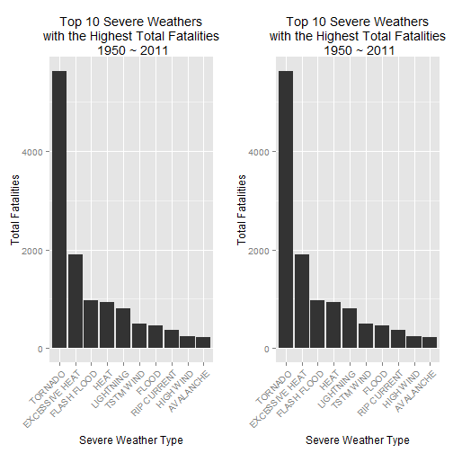
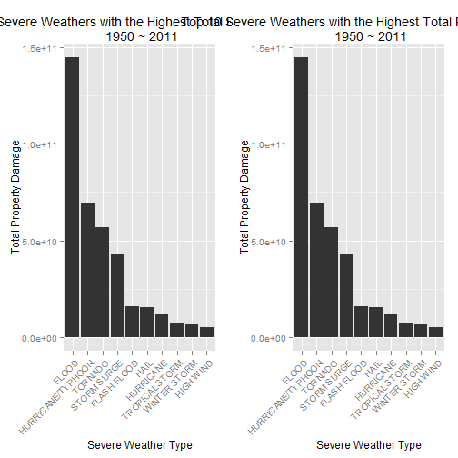

## Synonpsis

In this analysis I aim to evaluate the impact of various severe weathers on public health and economy in U.S.
The NOAA Storm Data is analyzed.
Two features, namely total fatalities and injuries caused by each severe weather from 1950 to 2011, are used
to identify the most harmful disaster to public health.
Another two features, namely total property damage and crop damage by each disaster from 1950 to 2011, are used
to identify the most destructive severe weather to economy.
The results show that the most harmful severe weather to public health using the above-mentioned metrics is tornado.
And the most destructive disasters to economy are flood and drought respectively.

## Data Processing

### Set Up R Session

In this analysis I use package *data.table* for data mungling and *ggplot2* for data visualization.
Below is my code for session setup.


```r
# Set working directory:
setwd( "C:/Users/thinkpad/Desktop/00-Mathematics/03-Statistics/01-Basic Statistics/Projects/01-Data-Specialization-JHU-Coursera/04-Reproducible-Research/02-Assignment-Two" )
# Package for graphing:
library( ggplot2 )
library( gridExtra )
# Package for data processing:
library( data.table )
```

### Load Data


```r
# Raw data:
data <- data.table( read.csv( "data" , header = TRUE , stringsAsFactors = FALSE ) )
```

### Clean Data

#### Extract Record Years

First I extract record years of the observations:


```r
# Extract record years of the observations:
years <- strptime( data$BGN_DATE , "%m/%d/%Y %H:%M:%S" )$year + 1900
start_year <- min( years )
end_year <- max( years )
```

#### Pre-Process for Public Health Impact Analysis

I choose to analyze the impact of severe weathers on public health by 
exploring **the total fatalities and injuries caused by each type of event**.

To facilitate the analysis, I create a new data frame called **public_health_summary** 
which has three attributes, namely **event.type**, **total.fatalities** and **total.injuries**.


```r
# Extract related data:
public_health_data <- data[ , c( "FATALITIES" , "INJURIES" , "EVTYPE" ) , with = FALSE ]
# Create new data frame for public health impact analysis:
public_health_summary <- public_health_data[, lapply( .SD , sum , na.rm = TRUE ), by=EVTYPE ]
setnames( public_health_summary ,
          c( "EVTYPE" , "FATALITIES" , "INJURIES" ) ,
          c( "event.type" , "total.fatalities" , "total.injuries" )  )
```

#### Pre-Process for Economy Impact Analysis

I choose to analyze the impact of severe weathers on economy by 
exploring **the total property damage and crop damage caused by each type of event**.

To facilitate the analysis, I create a new data frame called **economy_summary** 
which has three attributes, namely **event.type**, **total.property.damage** and **total.crop.damage**. 
The two summaries are formed by first converting each observation to actual value then sum all the observations up.


```r
# Extract related data:
economy_data <- data[ , c( "PROPDMG" , "CROPDMG" , "EVTYPE" ) , with = FALSE ]
# Extract exponents for the two damage:
property_damage_exponents <- 
  ( as.integer( factor( data$PROPDMGEXP , levels = c( "" , "K" , "M" , "B" ) ) ) - 1 ) * 3
crop_damage_exponents <- 
  ( as.integer( factor( data$CROPDMGEXP , levels = c( "" , "K" , "M" , "B" ) ) ) - 1 ) * 3
# Convert damage to actual value
economy_data$PROPDMG <- economy_data$PROPDMG * ( 10^property_damage_exponents )
economy_data$CROPDMG <- economy_data$CROPDMG * ( 10^crop_damage_exponents )
# Create new data frame for economy impact analysis:
economy_summary <- economy_data[, lapply( .SD , sum , na.rm = TRUE ), by=EVTYPE ]
setnames( economy_summary ,
          c( "EVTYPE" , "PROPDMG" , "CROPDMG" ) ,
          c( "event.type" , "total.property.damage" , "total.crop.damage" )  )
```

## Data Analysis

### Analyze the Impact on Public Health

I analyze the impact of severe weathers on public health by identifying 
**top 10 events with the highest fatalities and injuries** 


```r
# Identify top 10 events with the highest fatalities:
top_fatalities <- public_health_summary[ head( with( public_health_summary , order( -total.fatalities ) ) , 10 ) ,
                                         c( "event.type" , "total.fatalities" ) , with = FALSE  ]
top_fatalities$event.type <- factor( top_fatalities$event.type , levels = top_fatalities$event.type )
# Identify top 10 events with the highest injuries:
top_injuries <- public_health_summary[ head( with( public_health_summary , order( -total.injuries ) ) , 10 ) ,
                                         c( "event.type" , "total.injuries" ) , with = FALSE  ]
top_injuries$event.type <- factor( top_injuries$event.type , levels = top_injuries$event.type )
```

### Analyze the Impact on Economy

I analyze the impact of severe weathers on economy by identifying 
**top 10 events with the highest property damage and crop damage** 


```r
# Identify top 10 events with the highest fatalities:
top_property_damage <- economy_summary[ head( with( economy_summary , order( -total.property.damage ) ) , 10 ) ,
                                        c( "event.type" , "total.property.damage" ) , with = FALSE  ]
top_property_damage$event.type <- factor( top_property_damage$event.type , levels = top_property_damage$event.type )
# Identify top 10 events with the highest injuries:
top_crop_damage <- economy_summary[ head( with( economy_summary , order( -total.crop.damage ) ) , 10 ) ,
                                         c( "event.type" , "total.crop.damage" ) , with = FALSE  ]
top_crop_damage$event.type <- factor( top_crop_damage$event.type , levels = top_crop_damage$event.type )
```

## Results

### The Impact of Severe Weathers on Public Health

Here are the top 10 events with the highest fatalities:


```
##         event.type total.fatalities
##  1:        TORNADO             5633
##  2: EXCESSIVE HEAT             1903
##  3:    FLASH FLOOD              978
##  4:           HEAT              937
##  5:      LIGHTNING              816
##  6:      TSTM WIND              504
##  7:          FLOOD              470
##  8:    RIP CURRENT              368
##  9:      HIGH WIND              248
## 10:      AVALANCHE              224
```

Here are the top 10 events with the highest injuries:


```
##            event.type total.injuries
##  1:           TORNADO          91346
##  2:         TSTM WIND           6957
##  3:             FLOOD           6789
##  4:    EXCESSIVE HEAT           6525
##  5:         LIGHTNING           5230
##  6:              HEAT           2100
##  7:         ICE STORM           1975
##  8:       FLASH FLOOD           1777
##  9: THUNDERSTORM WIND           1488
## 10:              HAIL           1361
```

 

From the above statistics we can see that the most harmful severe weathers to public health
with respect to total fatalities and injuries caused from 1950 to 2011 is **Tornado**.

The code for bar plots generation is as follows:


```r
fatalities_plot <- qplot( event.type , data = top_fatalities , weight = total.fatalities ,
                 geom = "bar" ,
                 xlab = "Severe Weather Type" , ylab = "Total Fatalities" , 
                 main = paste( "Top 10 Severe Weathers\nwith the Highest Total Fatalities\n" , 
                               paste( toString( start_year ) , "~" , toString( end_year ) ) ) ) + 
                 theme( axis.text.x = element_text( angle = 45 , hjust = 1 ) )
injuries_plot <- qplot( event.type , data = top_fatalities , weight = total.fatalities ,
                      geom = "bar" ,
                      xlab = "Severe Weather Type" , ylab = "Total Fatalities" , 
                      main = paste( "Top 10 Severe Weathers\nwith the Highest Total Fatalities\n" , 
                                    paste( toString( start_year ) , "~" , toString( end_year ) ) ) ) + 
                      theme( axis.text.x = element_text( angle = 45 , hjust = 1 ) )
grid.arrange( fatalities_plot , injuries_plot , ncol = 2 )
```

### The Impact of Severe Weathers on Economy

Here are the top 10 events with with the highest property damage:


```
##            event.type total.property.damage
##  1:             FLOOD          144657709807
##  2: HURRICANE/TYPHOON           69305840000
##  3:           TORNADO           56925660483
##  4:       STORM SURGE           43323536000
##  5:       FLASH FLOOD           16140811717
##  6:              HAIL           15727366777
##  7:         HURRICANE           11868319010
##  8:    TROPICAL STORM            7703890550
##  9:      WINTER STORM            6688497250
## 10:         HIGH WIND            5270046260
```

Here are the top 10 events with with the highest crop damage:


```
##            event.type total.crop.damage
##  1:           DROUGHT       13972566000
##  2:             FLOOD        5661968450
##  3:       RIVER FLOOD        5029459000
##  4:         ICE STORM        5022113500
##  5:              HAIL        3025537453
##  6:         HURRICANE        2741910000
##  7: HURRICANE/TYPHOON        2607872800
##  8:       FLASH FLOOD        1421317100
##  9:      EXTREME COLD        1292973000
## 10:      FROST/FREEZE        1094086000
```

 

From the above statistics we can see that the most harmful severe weathers to economy
with respect to total property damage and crop damage are **Flood** and *Drought* respectively.

The code for bar plots generation is as follows:

```r
property_damage_plot <- qplot( event.type , data = top_property_damage , weight = total.property.damage ,
                        geom = "bar" ,
                        xlab = "Severe Weather Type" , ylab = "Total Property Damage" , 
                        main = paste( "Top 10 Severe Weathers with the Highest Total Property Damage\n" , 
                                      paste( toString( start_year ) , "~" , toString( end_year ) ) ) ) + 
                        theme( axis.text.x = element_text( angle = 45 , hjust = 1 ) )
crop_damage_plot <- qplot( event.type , data = top_property_damage , weight = total.property.damage ,
                           geom = "bar" ,
                           xlab = "Severe Weather Type" , ylab = "Total Property Damage" , 
                           main = paste( "Top 10 Severe Weathers with the Highest Total Property Damage\n" , 
                                         paste( toString( start_year ) , "~" , toString( end_year ) ) ) ) + 
                           theme( axis.text.x = element_text( angle = 45 , hjust = 1 ) )
grid.arrange( property_damage_plot , crop_damage_plot , ncol = 2 )
```

## Conclusion

After analyzing the NOAA storm data, I find that the most harmful disaster to public health 
with respect to total fatalities and injuries caused from 1950 to 2011 is **Tornado**.
I also identify **Flood** and **Drought** as the most destructive disaster to economy 
with respect to total property damage and crop damage caused from 1950 to 2011 respectively.
